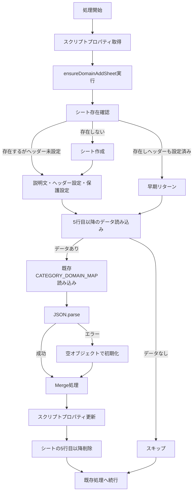

# ドメイン追加シート機能の実装計画書

## 概要

Google Apps Script (GAS) の既存コードを拡張し、スプレッドシートから動的に「仕分けドメイン」を追加・保存する機能を実装しました。これにより、スクリプトプロパティを直接編集することなく、スプレッドシート上でドメインの追加・管理が可能になります。

## 背景・目的

### 現状の課題

- 仕分けルール（シート名とドメインの対応）は、スクリプトプロパティの `CATEGORY_DOMAIN_MAP` にJSON形式で格納されている
- ドメインを追加・変更する際は、スクリプトプロパティを直接編集する必要がある
- 非技術者にとって操作が難しい

### 解決策

- 「ドメイン追加」シートにデータを入力するだけで、自動的にスクリプトプロパティが更新される
- スプレッドシート上で直感的にドメイン管理が可能になる

## 実装内容

### 1. 新規関数の追加

#### 1.1 `ensureDomainAddSheet()` 関数

「ドメイン追加」シートの初期化を行う関数を新規作成しました。

**関数仕様:**
- **引数**: 
  - `sheetManager`: SpreadsheetApp.Spreadsheet オブジェクト
- **戻り値**: SpreadsheetApp.Sheet オブジェクト（ドメイン追加シート）
- **処理内容**:
  1. シートが既に存在し、ヘッダー行（4行目）も正しく設定されている場合は早期リターン（実行時間短縮のため）
  2. シートが存在しない場合は自動作成
  3. 1-3行目に使い方の説明文を設定
     - 1行目1列目：目的の説明文
     - 2行目1列目：入力方法の説明文
     - 3行目1列目：注意事項の説明文
  4. 4行目にヘッダー行（「出力先シート名」「ドメイン名」）を設定
  5. 4行目を固定（`setFrozenRows(4)`）して説明文とヘッダー行を固定
  6. 1行目以降の1列目と2列目を保護設定（説明文も含む）
     - 実行ユーザーのみ編集可能
     - 背景色は4行目以降のみ `#f3f3f3` に設定（1-3行目の説明文は背景色なし）

#### 1.2 `mergeDomainFromSheet()` 関数

ドメイン情報の読み込みとマージ処理を行う関数を新規作成しました。

**関数仕様:**
- **引数**: 
  - `sheetManager`: SpreadsheetApp.Spreadsheet オブジェクト
  - `props`: PropertiesService.ScriptProperties オブジェクト
- **戻り値**: なし（副作用でプロパティとシートを更新）
- **処理内容**:
  1. `ensureDomainAddSheet()` を呼び出してシートを初期化
  2. データ行（5行目以降）の読み込み
  3. 既存の `CATEGORY_DOMAIN_MAP` とのマージ処理
  4. スクリプトプロパティの更新
  5. 処理済みデータ行（5行目以降）の削除

### 2. メイン関数への統合

`saveGmailToSheetBySenderWithDomainFilter()` 関数の冒頭に処理を追加しました。

**統合位置:**
- 環境変数取得後（8行目付近）
- `CATEGORY_DOMAIN_MAP` 読み込み前（59行目前）

これにより、毎回の実行時に最新のドメイン設定が反映されます。

## シート構成

### 「ドメイン追加」シートの構造

**シートの構成:**

| 行 | 列 | 内容 | 説明 |
|---|---|---|---|
| 1行目 | 1列目 | 説明文 | 「・スプレッドシートに出力したいメールアドレスの「ドメイン」と「出力先シート名」を入力することで、ドメインごとの仕分け設定ができます。」 |
| 2行目 | 1列目 | 説明文 | 「・5行目以降に出力先シート名とドメイン名（例 正：firstteam.com、誤り：@firstteam.com）を入力してください。」 |
| 3行目 | 1列目 | 説明文 | 「・処理後、入力したデータ行は自動的に削除されます。」 |
| 4行目 | 1列目 | ヘッダー | 出力先シート名 |
| 4行目 | 2列目 | ヘッダー | ドメイン名 |
| 5行目以降 | 1列目 | データ入力 | メールを転記する先のシート名 |
| 5行目以降 | 2列目 | データ入力 | 仕分け対象のドメイン（例: `example.com`） |

**データ入力例:**
```
| 出力先シート名 | ドメイン名 |
|--------------|-----------|
| 営業部       | sales.example.com |
| 営業部       | contact.example.com |
| 技術部       | tech.example.com |
```

### データ入力方法

1. 初回実行時に「ドメイン追加」シートが自動作成されます（手動で作成する必要はありません）
2. 「ドメイン追加」シートの5行目以降に、出力先シート名とドメイン名を入力
3. GASスクリプトを実行（またはトリガーで自動実行）
4. 処理後、入力したデータ行（5行目以降）は自動的に削除される

### シート保護設定

- **保護範囲**: 1行目以降の1列目（出力先シート名）と2列目（ドメイン名）の全行（説明文も含む）
- **編集権限**: 実行ユーザーのみ編集可能
- **背景色**: 4行目以降のみ `#f3f3f3`（1-3行目の説明文は背景色なし）
- **固定行**: 4行目（説明文とヘッダー行を固定、スクロール時も常に表示）
- **説明文の表示**: ラッピングを「はみ出す」に設定（`setWrap(false)`）

### パフォーマンス最適化

- シートが既に存在し、ヘッダー行（4行目）も正しく設定されている場合は、保護設定などの処理をスキップして早期リターンします
- これにより、2回目以降の実行時間を短縮できます

## 処理フロー



## シート初期化処理の詳細

### `ensureDomainAddSheet()` 関数の処理フロー

1. **早期リターンチェック**
   - シートが既に存在し、ヘッダー行（4行目の1列目）が「出力先シート名」である場合
   - 保護設定などの処理をスキップしてシートを返す
   - 実行時間を短縮するための最適化

2. **シート作成**
   - シートが存在しない場合は `insertSheet()` で作成
   - ログに作成を記録

3. **説明文の設定**
   - 1行目1列目：目的の説明文「・スプレッドシートに出力したいメールアドレスの「ドメイン」と「出力先シート名」を入力することで、ドメインごとの仕分け設定ができます。」
   - 2行目1列目：入力方法の説明文「・5行目以降に出力先シート名とドメイン名（例 正：firstteam.com、誤り：@firstteam.com）を入力してください。」
   - 3行目1列目：注意事項の説明文「・処理後、入力したデータ行は自動的に削除されます。」
   - 説明文は `setWrap(false)` で「はみ出す」表示に設定
   - 既に設定されている場合はスキップ

4. **ヘッダー行の設定**
   - 4行目に「出力先シート名」「ドメイン名」を設定
   - 既に設定されている場合はスキップ

5. **固定行の設定**
   - `setFrozenRows(4)` で4行目を固定
   - 説明文とヘッダー行がスクロール時も常に表示される

6. **保護設定**
   - 1行目以降の1列目と2列目（説明文も含む全行）を保護範囲に設定
   - 既存の保護を削除してから新規設定
   - 実行ユーザーのみ編集可能に設定
   - 背景色は4行目以降のみ `#f3f3f3` に設定（1-3行目の説明文は背景色なし）

### 保護設定の詳細

```javascript
// 保護範囲: 1行目以降の1列目と2列目（説明文も含む全行）
const range = sheet.getRange(1, 1, maxRows, 2);

// 既存の保護を削除
const protections = sheet.getProtections(SpreadsheetApp.ProtectionType.RANGE);
protections.forEach(protection => {
  // 対象範囲と一致する保護を削除
  if (protectionRange.getA1Notation() === rangeA1) {
    protection.remove();
  }
});

// 新しい保護を設定
const protection = range.protect().setDescription('Domain Add Sheet Protected');
const me = Session.getEffectiveUser().getEmail();
protection.removeEditors(protection.getEditors());
protection.addEditor(me);
protection.setWarningOnly(false);

// 背景色を設定（4行目以降のみ）
const backgroundRange = sheet.getRange(4, 1, maxRows - 3, 2);
backgroundRange.setBackground('#f3f3f3');
```

## マージ処理の詳細

### 処理ロジック

1. **既存シート名の確認**
   - シート名が既に `CATEGORY_DOMAIN_MAP` に存在する場合
     - 既存のドメイン配列に追加
   - シート名が存在しない場合
     - 新しいエントリを作成し、ドメイン配列を初期化

2. **重複チェック**
   - 既存のドメイン配列に同じドメインが含まれているか確認
   - 重複している場合はスキップ
   - 重複していない場合は追加

### マージ例

**既存の CATEGORY_DOMAIN_MAP:**
```json
{
  "営業部": ["sales.example.com", "contact.example.com"],
  "技術部": ["tech.example.com"]
}
```

**「ドメイン追加」シートの入力:**
```
| 出力先シート名 | ドメイン名 |
|--------------|-----------|
| 営業部       | support.example.com |
| 営業部       | sales.example.com |
| マーケティング部 | marketing.example.com |
```

**マージ後の CATEGORY_DOMAIN_MAP:**
```json
{
  "営業部": ["sales.example.com", "contact.example.com", "support.example.com"],
  "技術部": ["tech.example.com"],
  "マーケティング部": ["marketing.example.com"]
}
```

**処理結果:**
- `sales.example.com` は重複のためスキップ
- `support.example.com` は追加
- `marketing.example.com` は新規シートとして追加

## エラーハンドリング

### 1. シートの自動作成

```javascript
if (!sheet) {
  sheet = sheetManager.insertSheet(DOMAIN_SHEET_NAME);
  Logger.log(`[ドメイン追加] シート「${DOMAIN_SHEET_NAME}」を作成しました`);
}
```

- シートが存在しない場合は自動作成
- 初回実行時に自動的にシートが作成されるため、手動での作成は不要

### 2. データ行が存在しない場合

```javascript
if (lastRow <= 4) {
  Logger.log(`[ドメイン追加] シート「ドメイン追加」にデータ行がないためスキップ`);
  return;
}
```

- ヘッダー行（4行目）までしかない場合
- 処理をスキップ

### 3. 有効なデータ行がない場合

```javascript
const validRows = dataRows.filter(row => row[0] && row[1]);
if (validRows.length === 0) {
  Logger.log(`[ドメイン追加] 有効なデータ行がないためスキップ`);
  return;
}
```

- 出力先シート名またはドメイン名が空の行を除外
- 有効なデータがない場合は処理をスキップ

### 4. JSON.parse エラー

```javascript
try {
  const existingMapStr = props.getProperty('CATEGORY_DOMAIN_MAP') || '{}';
  categoryDomainMap = JSON.parse(existingMapStr);
  if (typeof categoryDomainMap !== 'object' || Array.isArray(categoryDomainMap)) {
    Logger.log('[ドメイン追加] 既存のCATEGORY_DOMAIN_MAPが不正な形式のため、空オブジェクトで初期化');
    categoryDomainMap = {};
  }
} catch (e) {
  Logger.log(`[ドメイン追加] JSON.parseエラー: ${e.message}。空オブジェクトで初期化`);
  categoryDomainMap = {};
}
```

- プロパティが空、または不正な形式の場合
- 空オブジェクト `{}` で初期化して処理を継続

### 5. 空の出力先シート名・ドメイン名

```javascript
if (!sheetName || !domain) {
  Logger.log(`[ドメイン追加] 行${index + 5}: 出力先シート名またはドメイン名が空のためスキップ`);
  return;
}
```

- 個別の行でエラーが発生しても、他の行の処理は継続
- 行番号は5行目以降のデータ行を基準に表示（`index + 5`）

## ログ出力

処理の各段階でログを出力し、動作状況を確認できます。

### ログ例

```
[ドメイン追加] シート「ドメイン追加」を作成しました
[ドメイン追加] 1行目の説明文を設定しました
[ドメイン追加] 2行目の説明文を設定しました
[ドメイン追加] 3行目の説明文を設定しました
[ドメイン追加] ヘッダー行を設定しました
[ドメイン追加] 1行目以降の1列目と2列目の保護を設定しました（実行ユーザー: user@example.com）
[ドメイン追加] 追加: シート名=マーケティング部, ドメイン=marketing.example.com
[ドメイン追加] 追加: シート名=営業部, ドメイン=support.example.com
[ドメイン追加] スキップ（重複）: シート名=営業部, ドメイン=sales.example.com
[ドメイン追加] プロパティ更新完了: 新規シート=1, 追加ドメイン=2
[ドメイン追加] シートのデータ行（3行）を削除しました
```

## 実装ファイル

- **ファイル**: `gmail-sheets-gas-sync/main.js`
- **追加関数**: 
  - `ensureDomainAddSheet()` (425-500行目): シートの初期化、説明文設定、保護設定
  - `mergeDomainFromSheet()` (505-605行目): ドメイン情報の読み込みとマージ処理
- **統合箇所**: `saveGmailToSheetBySenderWithDomainFilter()` (10-12行目)

## 使用例

### 基本的な使用方法

1. GASスクリプトを実行（初回実行時に「ドメイン追加」シートが自動作成されます）
2. 「ドメイン追加」シートの5行目以降に、出力先シート名とドメイン名を入力
3. GASスクリプトを再実行（またはトリガーで自動実行）
4. 処理後、入力したデータ行（5行目以降）は自動的に削除される

**注意**: 
- シートは初回実行時に自動的に作成され、説明文、ヘッダー行、保護設定も自動的に適用されます
- 1-3行目には使い方の説明文が表示されます
- 4行目がヘッダー行で、5行目以降がデータ入力エリアです

### 複数ドメインの一括追加

同じ出力先シート名に対して複数のドメインを一度に追加できます。

```
| 出力先シート名 | ドメイン名 |
|--------------|-----------|
| 営業部       | domain1.example.com |
| 営業部       | domain2.example.com |
| 営業部       | domain3.example.com |
```

上記のように5行目以降に入力すると、すべてのドメインが「営業部」シートに追加されます。

## 注意事項

### 1. 重複ドメイン

- 既に存在するドメインは追加されません
- ログに「スキップ（重複）」と出力されます

### 2. データ行の削除

- 処理が成功した場合、5行目以降のデータ行は自動的に削除されます
- エラーが発生した場合でも、処理済みのデータは削除されます
- 処理を再実行する場合は、再度データを入力してください
- 1-4行目（説明文とヘッダー行）は削除されません

### 3. シート名の大文字小文字

- シート名は大文字小文字を区別します
- 「営業部」と「営業部」は同じシート名として扱われますが、「営業部」と「営業部」は異なるシート名として扱われます

### 4. シート保護について

- 1行目以降の1列目と2列目は保護されており、実行ユーザーのみが編集可能です
- 保護された列のうち、4行目以降（ヘッダー行とデータ入力エリア）は背景色 `#f3f3f3` で表示されます
- 1-3行目の説明文は保護されていますが、背景色は設定されていません
- 4行目（ヘッダー行）は固定されており、スクロール時も常に表示されます
- 保護設定は初回実行時に自動的に適用され、以降の実行では設定済みの場合はスキップされます（パフォーマンス最適化）

### 5. 説明文の表示

- 説明文は `setWrap(false)` で「はみ出す」表示に設定されています
- セルの幅を超えても折り返されず、隣のセルにはみ出すように表示されます

## 今後の拡張可能性

### 1. ドメイン削除機能

現在は追加のみですが、削除機能を追加することで、より柔軟な管理が可能になります。

### 2. バリデーション強化

ドメイン名の形式チェックを強化し、不正な形式のドメインを事前に検出できます。

### 3. 一括更新機能

既存のドメイン設定を一括で更新する機能を追加できます。

### 4. 履歴管理

追加・削除の履歴を別シートに記録する機能を追加できます。

